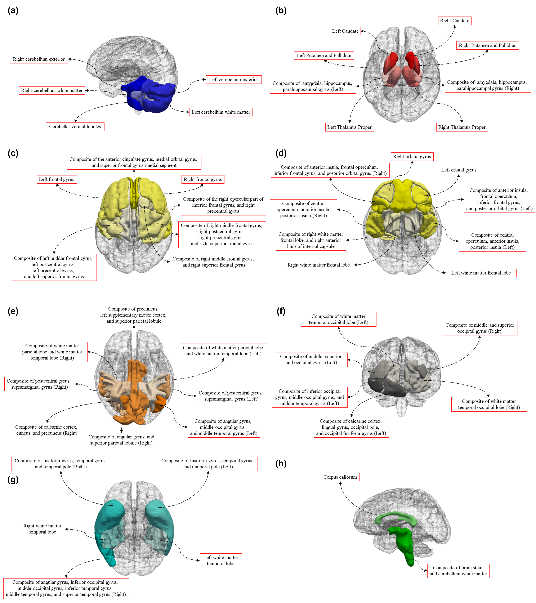
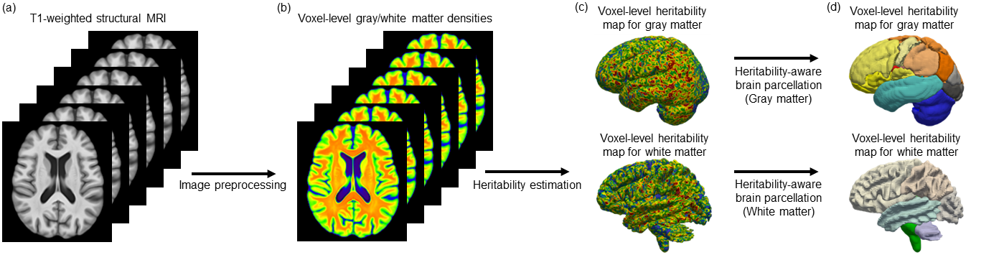
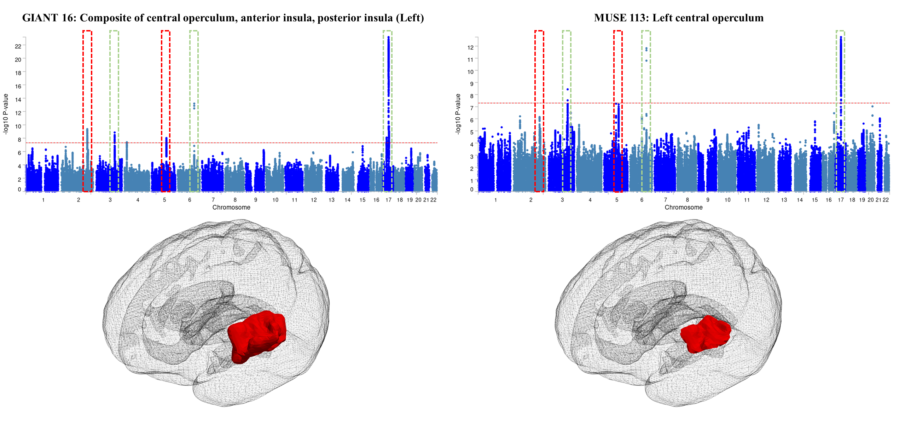

# Genetically informed brain atlas (GIANT) for enhancing neuroimaging genetics studies

```diff
@@ IMPORTANT UPDATE @@
! We are currently working on addressing the comments received from the reviewers. 
! We will release the updated scripts and results shortly!
```

This repository includes the **Genetically Informed brAiN Ttlas (GIANT)** with its implementation, and all imaging-genetics subsequent analysis summary statistics for the GIANT. 

[ShenLab@Penn](https://www.med.upenn.edu/shenlab/)
[LongLab@Penn](https://www.med.upenn.edu/long-lab/)

## GIANT - A genetically informed brain atlas

We introduce GIANT, a Genetically Informed brAiN aTlas. Our novel three-dimensional heritability-aware brain parcellation algorithm was applied to the densities of gray and white matter respectively, resulting in tissue-specific brain parcellations. We annotated GIANT into 7 anatomical sub-structures: cerebellum (**a**), deep gray matter and white matter structure (**b**), frontal structure (**c** and **d**), parietal structure (**e**), occipital structure (**f**), temporal structure (**g**), and others (**h**). 

The NIFTI file for GIANT and its specifications: https://github.com/JingxuanBao/GIANT/tree/main/GIANT

<p>
	
</p>

We developed a novel brain annotation method that can annotate the new generated brain atlas using the reference atlas: https://github.com/JingxuanBao/GIANT/tree/main/scripts/BrainRegionNaming.py. 

## 3D heritability-aware brain parcellation model

We developed a 3D heritability-aware brain parcellation model that integrates voxel-wise heritability and spatial proximity to cluster brain voxels into genetically informed regions.

You may find the implementation and tuning: https://github.com/JingxuanBao/GIANT/blob/main/scripts/GIANT.py and https://github.com/JingxuanBao/GIANT/blob/main/scripts/GIANT-TUNE.py

<p>
	
</p>

We introduced the GIANT atlas with a novel framework to define it, aimed at enhancing the discovery power for brain imaging-genomics studies. Briefly, we first designed a novel heritability-aware brain parcellation model - a 3D clustering method that integrates heritability and spatial proximity. Then, we applied our heritability-aware brain parcellation model to the SNP heritability derived from voxel-level gray matter and white matter densities. As a result, our framework grouped the spatially closed brain voxels with similar heritability, leading to the creation of 50 genetically informed brain ROIs. 

## Genome-wide association study summary statistics

To access the discovery power of GIANT, we conducted region-level GWAS using GIANT, MUSE, and a genetically informed brain atlas developed with the Watershed algorithm. Link to GWAS summary statistics with FUMA post GWAS analyses: https://upenn.box.com/v/GeneticallyInformedBrainAtlas

Genome builder: GRCh37

<p>
	
</p>

<p>
	
</p>

<p>
	
</p>

# Acknowledgement

This work was supported in part by the National Institutes of Health grants R01 AG071470, U01 AG068057, U01 AG066833, RF1 AG063481, RF1 AG068191, and R01 AG071174.

Data collection and sharing for this project was funded by the Alzheimer's Disease Neuroimaging Initiative (ADNI) (National Institutes of Health Grant U01 AG024904) and DOD ADNI (Department of Defense award number W81XWH-12-2-0012). ADNI is funded by the National Institute on Aging, the National Institute of Biomedical Imaging and Bioengineering, and through generous contributions from the following: AbbVie, Alzheimer’s Association; Alzheimer’s Drug Discovery Foundation; Araclon Biotech; BioClinica, Inc.; Biogen; Bristol-Myers Squibb Company; CereSpir, Inc.; Cogstate; Eisai Inc.; Elan Pharmaceuticals, Inc.; Eli Lilly and Company; EuroImmun; F. Hoffmann-La Roche Ltd and its affiliated company Genentech, Inc.; Fujirebio; GE Healthcare; IXICO Ltd.; Janssen Alzheimer Immunotherapy Research \& Development, LLC.; Johnson \& Johnson Pharmaceutical Research \& Development LLC.; Lumosity; Lundbeck; Merck \& Co., Inc.; Meso Scale Diagnostics, LLC.; NeuroRx Research; Neurotrack Technologies; Novartis Pharmaceuticals Corporation; Pfizer Inc.; Piramal Imaging; Servier; Takeda Pharmaceutical Company; and Transition Therapeutics. The Canadian Institutes of Health Research is providing funds to support ADNI clinical sites in Canada. Private sector contributions are facilitated by the Foundation for the National Institutes of Health (www.fnih.org). The grantee organization is the Northern California Institute for Research and Education, and the study is coordinated by the Alzheimer’s Therapeutic Research Institute at the University of Southern California. ADNI data are disseminated by the Laboratory for Neuro Imaging at the University of Southern California.

# Maintainers

jingxuan.bao@pennmedicine.upenn.edu
