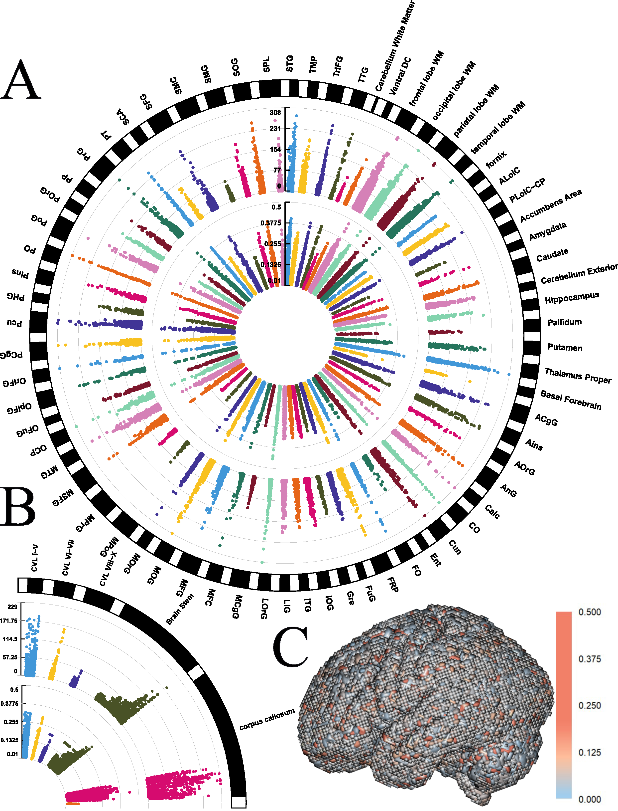
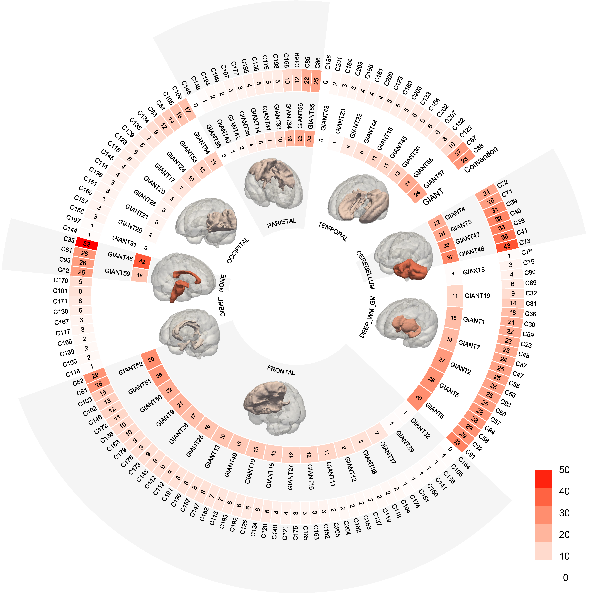

# Genetically informed brain atlas (GIANT) for enhancing neuroimaging genetics studies

This repository includes the **Genetically Informed brAiN Ttlas (GIANT)** with its implementation, and all imaging-genetics subsequent analysis summary statistics for the GIANT. 

## GIANT - A genetically informed brain atlas

We introduce GIANT, a genetically informed brain atlas. Our 3D clustering algorithm was applied separately to gray matter and white matter, and the best-tuned brain parcellations were integrated to define GIANT.  Our annotation results divided GIANT into 7 anatomical sub-structures: cerebellum (**A**), deep gray matter and white matter structure (**B**), frontal structure (**C** and **D**), occipital structure (**F**), parietal structure (**G**), temporal structure (**H**), and others (**E**).  

The NIFTI for GIANT and its specifications: https://github.com/JingxuanBao/GIANT/tree/main/GIANT

	

## 3D heritability-aware brain parcellation model

We propose a 3D heritability-aware brain parcellation model that integrates voxel-wise heritability and spatial proximity to cluster brain voxels into genetically informed regions.

You may find the implementation and example: https://github.com/JingxuanBao/GIANT/blob/main/scripts/Her_Atlas.py

	

## Voxel-level heritability estimates

The voxel-level heritability estiamtes for UK Biobank (UKBB): https://github.com/JingxuanBao/GIANT/tree/main/example_data/voxel_heritability_UKBB

The voxel-level heritability estimates for Alzheimer's disease neuroimaging initiative (ADNI): https://github.com/JingxuanBao/GIANT/tree/main/example_data/voxel_heritability_ADNI

	

## Regional-level heritability estimates for GIANT

The regional-level heritability estimates for UKBB and ADNI using GIANT brian parcellation: https://github.com/JingxuanBao/GIANT/tree/main/GIANT/GIANT_regional_heritability

## Genome-wide association study summary statistics

We conducted a regional-level GWAS on both GIANT and the conventional brain atlas using the UKBB imaging-genetics cohort and the ADNI imaging-genetics cohort. 

We performed the linear regression on 59 heritability-aware brain atlas defined ROIs and 140 MUSE atlas defined ROIs. Each ROI defines a brain regional level quantitative trait measuring the brain variations. Specifically, we fit a linear regression model for each ROI-SNP pair by treating imaging volumetric quantitative trait as the response variable and common-variant autosomal individual SNP as the independent variable. Our model was adjusted for age, sex, first 10 principal components, and AD-by-proxy/AD as covariates. The genome-wide significant threshold was set as $5\times 10^{-8}$. All GWAS analyses were performed using PLINK v1.9. For each ROI volumetric imaging QT, we performed the post-GWAS analysis using FUMA. FUMA is a web-based platform using information from multiple biological resources to facilitate functional annotation of GWAS results. We use the FUMA analysis protocol from Wen et al. We constructed LD blocks by tagging all variants with minor allele frequency greater than or equal to 0.0005 and with at least one of the independent significant variants. Of note, the LD blocks are constructed from the 1000 Genomes as reference panels, which may not be overlapped with the variants in the current study. Finally, FUMA merges the LD blocks of independent significant variants into a single genomic locus if they are within 250 kilobases from the closest boundary variants of LD blocks. We used the default parameters settings on FUMA online platform for the other unmentioned parameters. 

Genome builder: GRCh37

Link to GWAS summary statistics with FUMA post GWAS analyses (GIANT and Conventional brain atlas): https://upenn.box.com/v/GeneticallyInformedBrainAtlas

	

	

## Polygenetic risk scores

We estimate the PRSs for regional-level brain variations defined by both GIANT and the conventional brain atlas on both the UKBB and the ADNI imaging-genetics cohorts. For the PRS analysis of the UKBB imaging-genetics cohort, we use the base GWAS summary statistics calculated from the ADNI study. Similarly, we use the base GWAS summary statistics calculated from the UKBB study to estimate the PRSs for regional-level brain variations in the ADNI cohort. All the analyses are performed using PRSice-2. 

Link to polygenetic risk score (GIANT and Conventional brain atlas): https://upenn.box.com/v/GeneticallyInformedBrainAtlas

